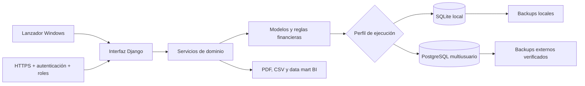

# 💳 Gestión Financiera

Aplicación gratuita para administrar **clientes, ventas financiadas, préstamos, cuotas, recargos y cobranzas**. El modo portable funciona localmente sin nube; el perfil multiusuario optativo agrega PostgreSQL, autenticación, HTTPS y auditoría.

> 🧭 **Posicionamiento:** proyecto de ingeniería de producto aplicada al dominio financiero.<br>
> 🔒 **Privacidad:** la base, los respaldos y las exportaciones permanecen en el equipo del usuario.<br>
> 🪟 **Entrega prevista:** aplicación portable para Windows, sin requerir Python en la PC de destino.
> 👥 **Escalado optativo:** despliegue multiusuario reproducible sin alterar el modo local.


## ✨ Qué problema resuelve

Gestión Financiera concentra el ciclo operativo de un negocio que vende o presta dinero en cuotas:

- registra clientes, productos, ventas y préstamos;
- genera calendarios semanales, quincenales o mensuales;
- calcula saldos y recargos con importes decimales;
- admite pagos completos, parciales y anulaciones trazables;
- prioriza la cobranza diaria y semanal;
- conserva el historial de cada cliente;
- produce reportes, planillas y estados de cuenta en PDF;
- crea, valida y restaura copias de seguridad;
- permite acceso temporal desde un celular dentro de la red local.
- analiza aging, recuperación, comportamiento de pago y cohortes mensuales;
- exporta un data mart reconciliado y listo para Power BI.

## 🖼️ Recorrido visual

Todas las capturas utilizan la base demo incluida; nombres, documentos, domicilios, teléfonos e importes son ficticios.


La animación resume el recorrido operación → cuotas/pagos → cobranza → reportes. Se genera de forma reproducible desde las capturas ficticias con `scripts/build_demo_gif.py`.

| Historial del cliente | Reportes operativos |
|---|---|
|  |  |

### Ventas y préstamos en un mismo flujo


El préstamo se modela como una operación financiera y no como un producto ficticio. Así, los rankings de productos siguen siendo consistentes y los saldos reutilizan el mismo motor de cuotas, pagos y recargos.

## 🧱 Arquitectura



| Capa | Responsabilidad |
|---|---|
| `app/modules/core/models.py` | Integridad de clientes, operaciones, cuotas, pagos y visitas. |
| `app/modules/core/services/` | Saldos, recargos, pagos, reportes, exportaciones y PDF. |
| `app/templates/` + `app/static/` | Interfaz responsive y vistas imprimibles. |
| `launcher/` | Inicio local, backups, restauración y acceso móvil temporal. |
| `scripts/` | Instalación, pruebas y construcción del portable. |
| `deploy/` | PostgreSQL, Gunicorn y proxy HTTPS para el perfil multiusuario. |

## 🧰 Stack

- Python 3.12
- Django 5.2
- SQLite
- PostgreSQL 17, Docker Compose y Caddy en el perfil multiusuario
- Pytest + Coverage
- Ruff
- PyInstaller para la distribución portable
- HTML, CSS y JavaScript sin framework de frontend

## ▶️ Inicio rápido para desarrollo

En Windows, desde la raíz del proyecto:

```powershell
powershell -ExecutionPolicy Bypass -File .\scripts\InstalarDesarrollo.ps1
```

Después se puede iniciar con:

```text
scripts\Iniciar.bat
```

O ejecutar el servidor con consola:

```powershell
powershell -ExecutionPolicy Bypass -File .\scripts\Desarrollo.ps1
```

## 🧪 Demo reproducible y segura

La demo debe ejecutarse contra una carpeta separada para no tocar una base real:

```powershell
$env:GESTION_DATA_DIR="$PWD\tmp\demo\data"
$env:GESTION_BACKUP_DIR="$PWD\tmp\demo\backups"
$env:GESTION_EXPORT_DIR="$PWD\tmp\demo\exports"
$env:GESTION_MEDIA_DIR="$PWD\tmp\demo\media"

.\.venv\Scripts\python.exe app\manage.py migrate --noinput
.\.venv\Scripts\python.exe app\manage.py seed_demo_data --confirm-reset
.\.venv\Scripts\python.exe app\manage.py runserver
```

> ⚠️ `seed_demo_data --confirm-reset` elimina los datos comerciales de la base seleccionada. Por eso el ejemplo dirige todas las carpetas a `tmp/demo/`.

## 👥 Perfil multiusuario y HTTPS

El modo local continúa siendo el predeterminado. Para una instalación compartida utilizo un perfil separado con:

- inicio de sesión y roles `Administradores` / `Cobradores`;
- PostgreSQL con transacciones por request, bloqueo de filas e idempotencia de pagos;
- Caddy como terminación HTTPS y Gunicorn como servidor de aplicación;
- auditoría inmutable de operaciones web exitosas;
- backups PostgreSQL mediante `pg_dump`, verificados con `pg_restore --list` y guardados fuera del contenedor.

La guía reproducible, la matriz de permisos y el procedimiento de recuperación están en [GF-C1 y GF-C2](docs/C1_C2_MULTIUSUARIO_ANALITICA.md). El despliegue comienza copiando `deploy/.env.example` a `deploy/.env`; nunca se versiona el archivo real.

```bash
docker compose -f deploy/compose.yml up -d --build
docker compose -f deploy/compose.yml exec app \
  python app/manage.py setup_multiuser --collector-username cobrador
```

## 📊 Analítica y Power BI

La vista **Analítica** utiliza las mismas reglas de cuotas, pagos, anulaciones y recargos que la operación diaria. Presenta:

- aging en cinco tramos;
- cartera total y vencida;
- recuperación del monto financiado y pago en fecha;
- cohortes por mes de originación;
- residuos de reconciliación visibles.


La exportación genera dimensiones, hechos, marts, diccionario y manifiesto en CSV UTF-8. Omite nombres, DNI, teléfonos, domicilios, observaciones y credenciales. Se puede reproducir desde la interfaz o con el servicio documentado.

## ✅ Calidad verificada

Validación base del 13/08/2026 y ampliación C1–C2 del 27/08/2026:

- **225 pruebas aprobadas**;
- **88% de cobertura** de líneas y ramas combinadas;
- análisis de Ruff sin observaciones;
- `manage.py check` sin errores;
- ninguna migración pendiente.

Para repetir los controles:

```powershell
powershell -ExecutionPolicy Bypass -File .\scripts\Probar.ps1
```

El workflow de CI ejecuta análisis estático, chequeos de Django, control de migraciones, pruebas y cobertura mínima del 85%. Un job Linux adicional instala el lock de nube, ejecuta los controles de seguridad de Django y valida la topología Docker Compose.

## 📦 Entrega portable

La aplicación puede construirse como carpeta y ZIP portable versionado:

```powershell
powershell -ExecutionPolicy Bypass -File .\scripts\ConstruirPortable.ps1
```

El proceso ejecuta pruebas, genera los ejecutables, valida una copia aislada y crea un manifiesto de integridad. Para `v1.1.0`, los resultados locales son `portable/GestionFinanciera-v1.1.0-windows-x64.zip` y `portable/SHA256SUMS.txt`.

Antes de publicar, el gate de seguridad vuelve a extraer el ZIP, rechaza datos o secretos, repite el smoke test y ejecuta Microsoft Defender:

```powershell
powershell -ExecutionPolicy Bypass -File .\scripts\AuditarPaqueteRelease.ps1 `
  -ArchivoZip .\portable\GestionFinanciera-v1.1.0-windows-x64.zip `
  -ReportPath .\portable\release-audit.json
```

Los binarios, ZIP y carpetas generadas **no se versionan en Git**: se adjuntan a [GitHub Releases](https://github.com/HeKoXCode/gestion-financiera-local/releases) junto con `SHA256SUMS.txt`, el reporte de auditoría y las notas del [changelog](CHANGELOG.md). La versión vigente `v1.1.0` no tiene firma Authenticode; la decisión, el posible aviso de SmartScreen y la evidencia completa están documentados en [GF-I1 a GF-I4](docs/I1_I4_RELEASE.md).

## 💾 Datos, respaldo y recuperación

```text
data/       Base SQLite y clave local
backups/    Copias de seguridad
exports/    Exportaciones CSV
storage/    Bases archivadas
media/      Logo y archivos cargados
```

Estas carpetas conservan únicamente sus `.gitignore`; su contenido no entra al repositorio. El restaurador valida el ZIP y crea una copia preventiva antes de reemplazar la base activa.

Para archivar una base completa y comenzar otra:

```text
scripts\ArchivarYReiniciar.bat
```

## 📱 Acceso desde celular

El modo móvil está desactivado al iniciar. Cuando el usuario lo habilita:

1. el servidor escucha temporalmente en la red local;
2. se genera una clave aleatoria para esa ejecución;
3. el QR contiene la dirección y la clave temporal;
4. el acceso se invalida al desactivarlo o cerrar la aplicación.

No se abre ningún puerto del router ni se habilita acceso desde Internet. La configuración detallada está en [ACCESO_DESDE_CELULAR.md](docs/ACCESO_DESDE_CELULAR.md).

## ⚠️ Alcance y limitaciones

- El portable sigue diseñado para una persona y una instalación local.
- El perfil multiusuario requiere dominio, HTTPS, PostgreSQL, backups externos y operación de infraestructura; no convierte el portable en un servicio cloud automático.
- No incluye sincronización entre instalaciones ni aplicación móvil nativa.
- SQLite se limita al perfil local; PostgreSQL es obligatorio para el despliegue compartido recomendado.
- No reemplaza un sistema contable, fiscal, bancario ni asesoramiento profesional.
- Los cálculos dependen de las reglas configuradas y deben verificarse antes de utilizarlos para decisiones reales.
- El usuario es responsable de conservar respaldos externos y proteger el equipo.

## 📚 Documentación

El [índice de documentación](docs/INDEX.md) separa el plan vigente, las guías operativas, la evidencia de calidad y los documentos históricos.

Documentos principales:

- [Plan vigente del MVP local](docs/PLAN_MVP_LOCAL.md)
- [Reglas financieras](docs/FASE_0_REGLAS_FINANCIERAS.md)
- [Acceso desde celular](docs/ACCESO_DESDE_CELULAR.md)
- [Manual de uso portable](docs/MANUAL_USO_PORTABLE.txt)
- [Guía de entrega](docs/GUIA_DE_ENTREGA_AL_CLIENTE.md)
- [Préstamos integrados](docs/PRESTAMOS_2026-08-06.md)
- [Release portable y evidencia GF-I1 a GF-I4](docs/I1_I4_RELEASE.md)
- [Multiusuario, despliegue y analítica GF-C1 a GF-C2](docs/C1_C2_MULTIUSUARIO_ANALITICA.md)
- [Política de seguridad](SECURITY.md)

## ⚖️ Licencia

El código y la documentación original se distribuyen bajo la [licencia MIT](LICENSE). Los nombres y marcas de terceros pertenecen a sus respectivos titulares.

---

**Percy Ignacio Marzoratti Hill**<br>
*Aplicación gratuita de gestión financiera local · Product Engineering*
