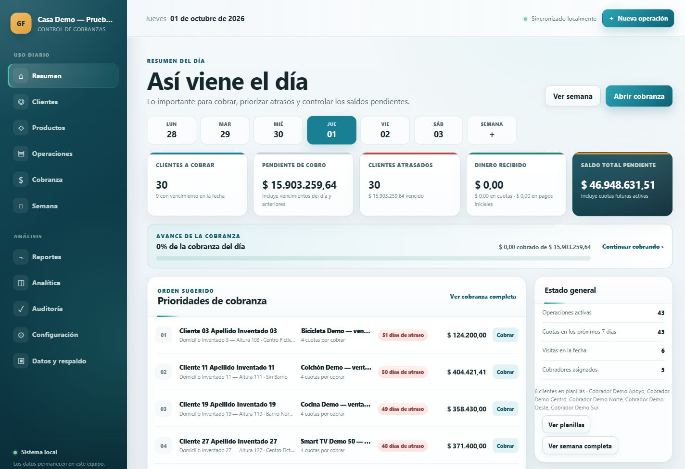
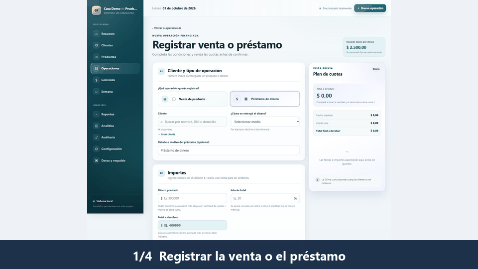
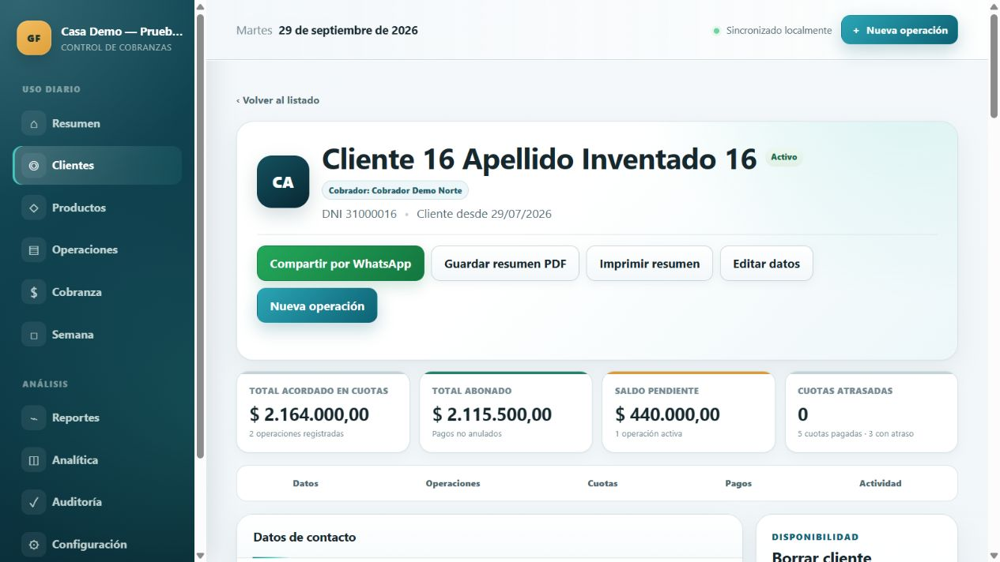
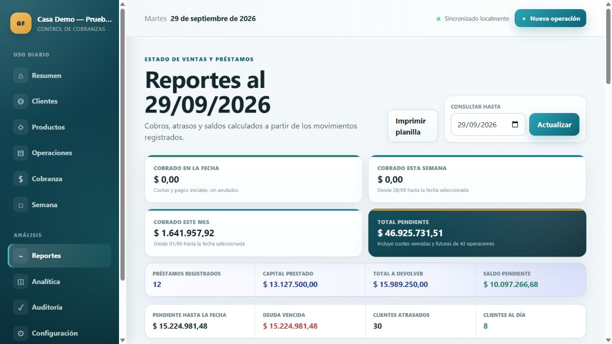
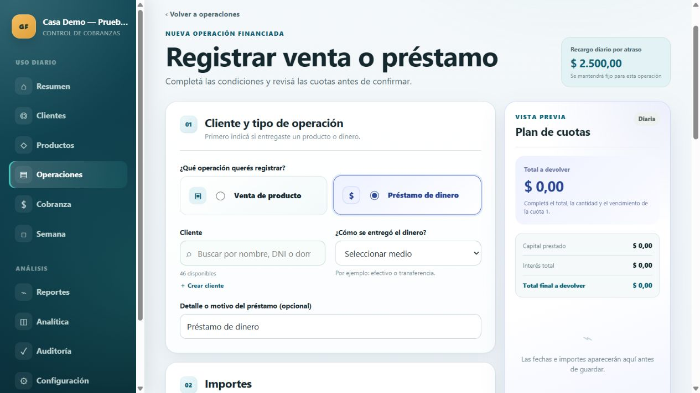
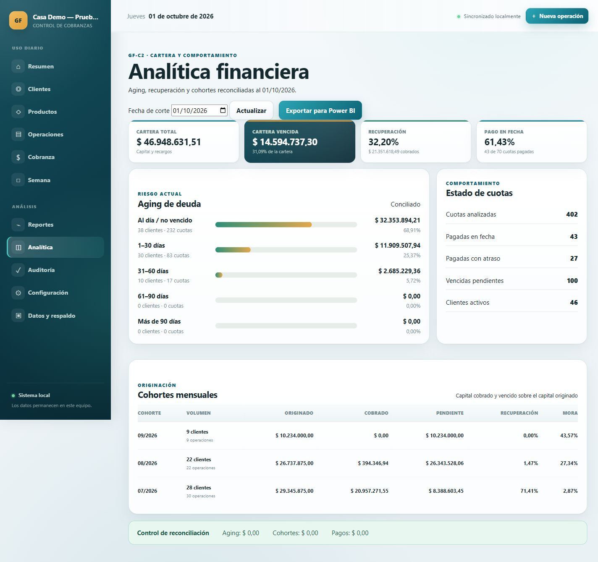
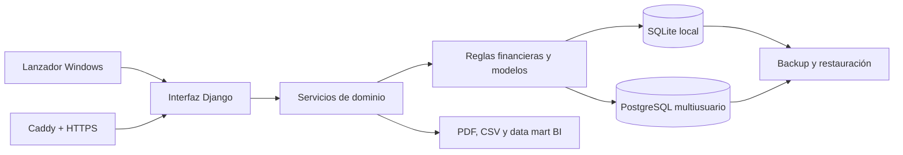

# 💳 Gestión Financiera v1.8.0

Desarrollé Gestión Financiera para administrar **ventas financiadas, préstamos,
cuotas, recargos y cobranza** sin depender obligatoriamente de servicios en la
nube. La edición publicada es gratuita, completa y reproducible: no limita la
cantidad de clientes y la demostración usa una base ficticia aislada.

> 🧭 **Producto:** aplicación financiera operativa con evidencia de ingeniería,
> calidad y analítica.<br>
> 🔒 **Privacidad:** en el perfil local, la base, los respaldos y las
> exportaciones permanecen en el equipo del usuario.<br>
> 🪟 **Entrega principal:** portable para Windows, sin Python instalado.<br>
> 🌐 **Perfil opcional:** despliegue multiusuario con PostgreSQL, login, roles,
> auditoría y HTTPS.



## ✨ Qué podés hacer

- Registrar clientes, productos, ventas financiadas y préstamos de dinero.
- Definir capital, medio de entrega, interés total y total a devolver en cada
  préstamo.
- Generar cuotas diarias, semanales, quincenales o mensuales.
- Registrar pagos completos, parciales, adelantados y anulaciones trazables.
- Calcular saldos, mora y recargos con importes decimales.
- Pausar y reactivar recargos futuros sin borrar el historial anterior.
- Organizar cobradores, recorridos y planillas de cobranza.
- Mantener versiones anteriores de clientes y operaciones en un Archivo seguro.
- Crear estados de cuenta PDF, reportes y exportaciones CSV.
- Analizar cartera, mora, aging, cohortes y recuperación con conciliaciones.
- Exportar un data mart seudonimizado y documentado para Power BI.
- Crear backups verificables y restaurar la edición local de forma controlada.
- Habilitar temporalmente el acceso desde un celular en la misma red local.

## 🖼️ Recorrido visual

Todas las capturas se generan con la base demo incluida. Los nombres,
documentos, domicilios, teléfonos e importes son ficticios.



| Historial de un cliente | Reportes operativos |
|---|---|
|  |  |

| Formulario de préstamo | Analítica conciliada |
|---|---|
|  |  |

## 🧱 Dos perfiles de ejecución

| Perfil | Uso recomendado | Base | Acceso | Distribución |
|---|---|---|---|---|
| Local portable | Una persona o un equipo que opera en una PC | SQLite | Sin login local; emparejamiento temporal para celular | ZIP Windows |
| Multiusuario | Operación compartida administrada | PostgreSQL | Login, roles, auditoría y HTTPS | Docker Compose + Caddy |

El portable **no se presenta como cloud**. El perfil multiusuario es otro modo
de despliegue y requiere que un técnico administre dominio, servidor, secretos,
backups y actualizaciones.


```mermaid
flowchart LR
  UI[Interfaz Django] --> S[Servicios de dominio]
  S --> M[Reglas financieras y modelos]
  M --> SQL[(SQLite local)]
  M --> PG[(PostgreSQL multiusuario)]
  S --> OUT[PDF, CSV y data mart BI]
  SQL --> BK[Backup y restauración]
  PG --> BK
  WIN[Lanzador Windows] --> UI
  WEB[Caddy + HTTPS] --> UI
```

## 🧰 Stack

- Python 3.12 y Django 5.2.
- SQLite para el portable; PostgreSQL para el perfil multiusuario.
- HTML, CSS y JavaScript sin framework de frontend.
- Pytest, Coverage y Ruff.
- PyInstaller para Windows.
- Docker Compose y Caddy para el perfil compartido.

## ▶️ Desarrollo local

En Windows, desde la raíz del proyecto:

```powershell
powershell -ExecutionPolicy Bypass -File .\scripts\InstalarDesarrollo.ps1
```

Después podés usar `scripts\Iniciar.bat` o iniciar con consola:

```powershell
powershell -ExecutionPolicy Bypass -File .\scripts\Desarrollo.ps1
```

## 🧪 Demo reproducible y segura

Usá directorios separados para no tocar una base real:

```powershell
$env:GESTION_DATA_DIR="$PWD\tmp\demo\data"
$env:GESTION_BACKUP_DIR="$PWD\tmp\demo\backups"
$env:GESTION_EXPORT_DIR="$PWD\tmp\demo\exports"
$env:GESTION_MEDIA_DIR="$PWD\tmp\demo\media"
$env:GESTION_STORAGE_DIR="$PWD\tmp\demo\storage"

.\.venv\Scripts\python.exe app\manage.py migrate --noinput
.\.venv\Scripts\python.exe app\manage.py seed_demo_data --confirm-reset
.\.venv\Scripts\python.exe app\manage.py runserver
```

> ⚠️ `seed_demo_data --confirm-reset` elimina los datos comerciales de la base
> seleccionada. El ejemplo la dirige a `tmp/demo/` para mantenerla aislada.

El portable incluye utilitarios numerados para cargar la demo, limpiarla y
restaurar la base original que se protege antes del cambio.

## 🌐 Perfil multiusuario

1. Copiá `deploy/.env.example` a `deploy/.env`.
2. Reemplazá dominio, secretos y contraseñas.
3. Configurá un directorio externo de backups.
4. Ejecutá `docker compose -f deploy/compose.yml up -d --build`.
5. Creá los usuarios iniciales con `setup_multiuser`.
6. Generá un backup y ensayá su restauración fuera de producción.

La matriz de permisos permite que un cobrador consulte la operación y registre
pagos o visitas, mientras que configuración, correcciones, anulaciones,
backups y auditoría quedan restringidos al administrador. Los detalles técnicos
están en [GF-C1 y GF-C2](docs/C1_C2_MULTIUSUARIO_ANALITICA.md).

## ✅ Calidad verificable

La validación integrada de la versión 1.8.0 incluye:

- **336 pruebas funcionales aprobadas**;
- cobertura verificada del **88%**, con umbral automático del **85%**;
- Ruff, `manage.py check` y control de migraciones;
- migración desde las historias 1.1.0 de GitHub y 1.7.2 local;
- smoke test del portable contra carpetas temporales;
- backup/restauración, demo aislada y búsqueda de datos sensibles;
- análisis del paquete con Microsoft Defender.

Podés repetir los controles de código con:

```powershell
powershell -ExecutionPolicy Bypass -File .\scripts\Probar.ps1
```

CI ejecuta análisis estático, chequeos de Django, migraciones, pruebas,
cobertura y validación del despliegue multiusuario en cada push y pull request.

## 📦 Portable y publicación

```powershell
powershell -ExecutionPolicy Bypass -File .\scripts\ConstruirPortable.ps1
```

El proceso produce:

- `portable/GestionFinanciera-v1.8.0-windows-x64.zip`;
- `portable/GestionFinanciera-actualizacion-1.8.0.zip`;
- `portable/SHA256SUMS.txt`;
- reportes JSON de auditoría para ambos ZIP.

Antes de publicar, el gate vuelve a extraer el ZIP, rechaza secretos o datos
reales, repite el smoke test y ejecuta Microsoft Defender:

```powershell
powershell -ExecutionPolicy Bypass -File .\scripts\AuditarPaqueteRelease.ps1 `
  -ArchivoZip .\portable\GestionFinanciera-v1.8.0-windows-x64.zip `
  -ReportPath .\portable\release-audit-v1.8.0.json
```

Los binarios y ZIP no se versionan en Git: se adjuntan a
[GitHub Releases](https://github.com/HeKoXCode/gestion-financiera-local/releases)
junto con sus hashes y notas.

## 💾 Datos y recuperación

```text
data/       Base SQLite y clave local
backups/    Copias verificadas
exports/    Exportaciones CSV y data mart BI
storage/    Logs y bases archivadas
media/      Logo y archivos cargados
```

Estas carpetas solo conservan sus `.gitignore`; el contenido del usuario no se
publica. El restaurador valida el ZIP y crea una copia preventiva antes de
reemplazar una base activa.

## 📱 Acceso desde celular

El acceso móvil local está desactivado al iniciar. Al habilitarlo, el lanzador
genera una clave temporal y un QR para la misma red. No abre puertos del router
ni publica la aplicación en Internet. Consultá
[Acceso desde celular](docs/ACCESO_DESDE_CELULAR.md).

## ⚠️ Alcance

- No existe sincronización offline entre instalaciones.
- La restauración de PostgreSQL requiere un administrador de infraestructura.
- La auditoría es inmutable desde la aplicación, no frente a acceso directo a
  la base.
- La exportación BI es un snapshot, no DirectQuery ni streaming.
- El interés de un préstamo es un porcentaje total aplicado una sola vez; no es
  una tasa bancaria compuesta.
- La aplicación no reemplaza contabilidad, facturación fiscal, servicios
  bancarios ni asesoramiento profesional.

## 📚 Documentación

- [Índice general](docs/INDEX.md)
- [Plan de integración y publicación 1.8.0](docs/PLAN_FINAL_GESTION_FINANCIERA_1.8.0.txt)
- [Reglas financieras](docs/FASE_0_REGLAS_FINANCIERAS.md)
- [GF-C1 y GF-C2: multiusuario y analítica](docs/C1_C2_MULTIUSUARIO_ANALITICA.md)
- [Manual portable](docs/MANUAL_USO_PORTABLE.txt)
- [Guía de entrega](docs/GUIA_DE_ENTREGA_AL_CLIENTE.md)
- [Política de seguridad](SECURITY.md)
- [Historial de cambios](CHANGELOG.md)

## ⚖️ Licencia

Distribuyo el código y la documentación original bajo la [licencia MIT](LICENSE).
Los nombres y marcas de terceros pertenecen a sus titulares.

---

**Percy Ignacio Marzoratti Hill**<br>
*Aplicación gratuita de gestión financiera · Product Engineering*
