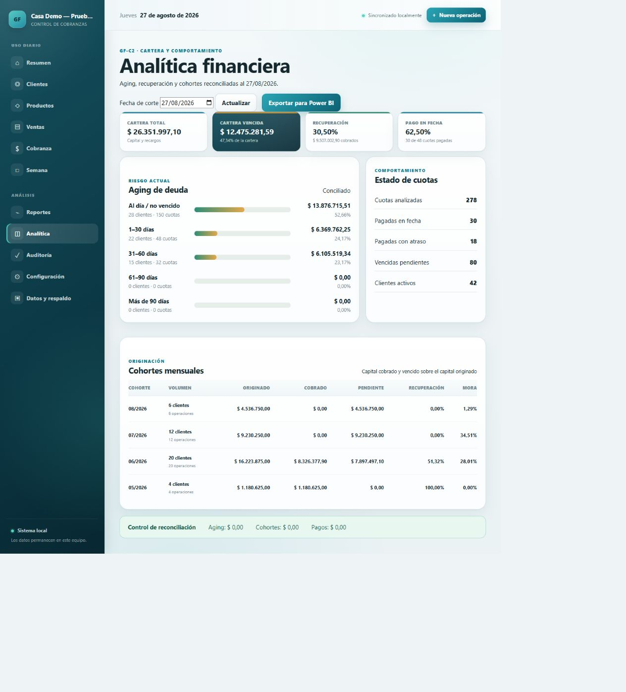

# GF-C1 y GF-C2 — multiusuario y analítica

Fecha de cierre: **27/08/2026**
Versión objetivo: **1.1.0**

## Resultado

La aplicación conserva el portable local sobre SQLite y suma un perfil compartido activable. No describo el portable como “cloud”: el perfil multiusuario es otro modo de despliegue, con PostgreSQL, autenticación, HTTPS, auditoría y operación de infraestructura explícita.

GF-C2 reutiliza el motor financiero existente para producir un snapshot analítico. La interfaz y la exportación Power BI consumen el mismo servicio; de este modo no existen dos definiciones distintas de deuda o recuperación.

## GF-C1 — controles implementados

### Roles

| Capacidad | Administrador | Cobrador |
|---|---:|---:|
| Consultar clientes, ventas, cobranza y analítica | Sí | Sí |
| Registrar pagos e intentos de cobranza | Sí | Sí |
| Crear o modificar clientes, productos y operaciones | Sí | No |
| Anular pagos o cancelar operaciones | Sí | No |
| Configuración, backups, exportaciones y auditoría | Sí | No |

El modo `local` no exige login para mantener compatibilidad. El modo `multiuser` rechaza usuarios sin rol. Las contraseñas del comando inicial se leen desde variables de entorno:

```bash
export GESTION_ADMIN_PASSWORD='una-clave-larga-y-unica'
export GESTION_COLLECTOR_PASSWORD='otra-clave-larga-y-unica'
python app/manage.py setup_multiuser \
  --admin-username admin \
  --collector-username cobrador
```

### Base y concurrencia

`GESTION_DATABASE_ENGINE=postgresql` configura conexiones persistentes con health checks y `ATOMIC_REQUESTS`. Los pagos ya usan `transaction.atomic`, `select_for_update` sobre la operación y una clave idempotente única; PostgreSQL convierte esos controles en bloqueo efectivo entre procesos concurrentes.

SQLite permanece limitado a una instalación local. No se recomienda ubicar una base SQLite en una carpeta de red.

### HTTPS

El contenedor no se expone directamente. Caddy termina TLS y reenvía al servicio Django. `GESTION_BEHIND_HTTPS_PROXY=1` activa:

- redirección HTTPS;
- cookies de sesión y CSRF seguras;
- HSTS;
- lectura controlada de `X-Forwarded-Proto`;
- hosts y orígenes CSRF explícitos.

### Auditoría

Cada operación HTTP exitosa que modifica estado registra usuario, acción, ruta, método, estado, origen, modo de despliegue y fecha. La aplicación no permite editar ni borrar eventos. No se guardan contraseñas ni el contenido de formularios.

### Backup y recuperación

El volumen `/backups` se monta desde `GESTION_BACKUP_HOST_PATH`, fuera del contenedor. Para crear una copia:

```bash
docker compose -f deploy/compose.yml exec app \
  python app/manage.py backup_database --label daily --retention 14
```

En PostgreSQL el comando ejecuta `pg_dump --format=custom`, valida el resultado con `pg_restore --list`, publica el archivo de forma atómica y aplica retención. La contraseña viaja en `PGPASSWORD`, no en la línea de comandos.

La pantalla **Datos y respaldo** usa el mismo servicio: en SQLite muestra y descarga copias `.sqlite3.zip`; en PostgreSQL crea, valida, lista y descarga `.dump` sin interpretar el nombre de la base como una ruta local. Por seguridad, la restauración PostgreSQL no se ejecuta desde la web.

Restauración controlada en una base vacía:

```bash
pg_restore --clean --if-exists --no-owner \
  --dbname "$PGDATABASE" /backups/gestion_postgresql_daily_AAAA-MM-DD_HHMMSS.dump
python app/manage.py migrate --noinput
python app/manage.py check --deploy --fail-level ERROR
```

Se debe ensayar la restauración fuera de producción antes de depender del backup.

### Despliegue reproducible

1. Copiar `deploy/.env.example` a `deploy/.env`.
2. Reemplazar dominio, secretos y contraseñas.
3. Crear el directorio externo de backups con permisos restringidos.
4. Ejecutar `docker compose -f deploy/compose.yml up -d --build`.
5. Crear roles y usuarios.
6. Ejecutar un backup y restaurarlo en un entorno de prueba.

CI instala `requirements-cloud.lock` con hashes, ejecuta los chequeos hardened de Django y valida la topología de Compose.

## GF-C2 — modelo analítico

### KPIs

| Métrica | Definición |
|---|---|
| Monto originado en cuotas | Total financiado de operaciones efectivas a la fecha de corte; incluye el ajuste financiero configurado |
| Monto cobrado en cuotas | Aplicaciones válidas a cuotas hasta la fecha de corte |
| Cartera total | Principal pendiente + recargos pendientes |
| Cartera vencida | Saldo de cuotas con vencimiento anterior a la fecha de corte |
| Recuperación | Capital cobrado / capital originado |
| Pago en fecha | Cuotas totalmente pagadas sin días de atraso / cuotas pagadas |

### Aging

Los tramos son: al día/no vencido, 1–30, 31–60, 61–90 y más de 90 días. Cada cuota pendiente pertenece exactamente a un tramo. El total de aging debe coincidir con la cartera total.

### Cohortes

La cohorte se define por el primer día del mes de entrega/originación. Por cohorte se publican clientes, operaciones, monto financiado originado, cobrado, pendiente, vencido, recuperación y mora.

### Data mart para Power BI

El ZIP contiene:

- `dim_clientes.csv` y `dim_productos.csv`;
- `fact_operaciones.csv`, `fact_cuotas.csv` y `fact_pagos.csv`;
- `mart_aging.csv` y `mart_cohortes.csv`;
- `metricas.csv`, `data_dictionary.csv`, `manifest.json` y `README.txt`.

Los archivos utilizan UTF-8 con BOM, `;` como delimitador, fechas ISO e importes con punto decimal. El mart seudonimiza por `cliente_id` y omite nombres, DNI, teléfono, domicilio, notas y credenciales.

### Reconciliaciones

La generación falla visualmente si cualquiera de estos residuos deja de ser cero:

1. suma de aging − cartera total;
2. suma del principal pendiente por cohortes − principal pendiente del portafolio;
3. pagos de cuotas registrados − aplicaciones de esos pagos.

### Evidencia visual reproducible



La captura se generó con `seed_demo_data --confirm-reset --as-of 2026-08-27`. Muestra aging, comportamiento, cohortes y los tres residuos de reconciliación en `$ 0,00`; no utiliza datos de una persona real.

El cierre local aprobó 225 pruebas con 88% de cobertura combinada, Ruff, `manage.py check` y control de migraciones sin observaciones.

## Límites que siguen vigentes

- No existe sincronización offline entre instalaciones.
- El despliegue productivo requiere administración de dominio, servidor, actualizaciones y monitoreo.
- La auditoría es inmutable desde la aplicación, no frente a un administrador directo de la base.
- La exportación BI es un snapshot, no streaming ni DirectQuery.
- El sistema no reemplaza contabilidad, facturación fiscal ni asesoramiento financiero.
