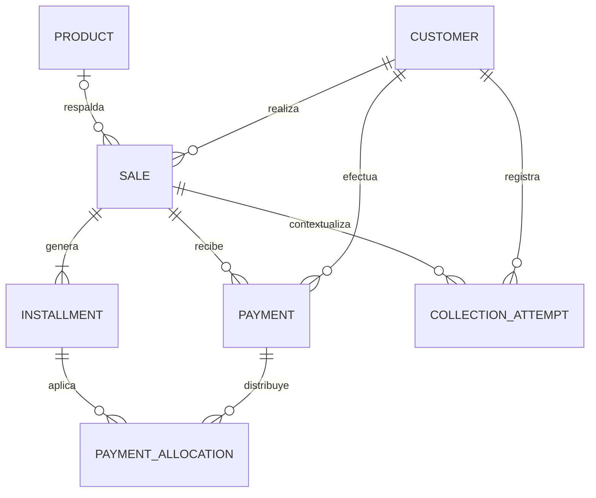

# GF-I1 a GF-I4 — release portable y evidencia

## Estado

Las etapas intermedias quedan cerradas con una release portable versionada, controles de distribución, CI de construcción y una demostración visual reproducible. Los artefactos binarios se publican en GitHub Releases y permanecen fuera del historial Git.

## GF-I1 — release portable verificable

La construcción oficial usa la versión declarada en `pyproject.toml` y produce:

```text
portable/GestionFinanciera-v1.0.0-windows-x64.zip
portable/SHA256SUMS.txt
portable/release-audit.json
```

El paquete incluye `VERSION.txt`, un manifiesto SHA-256 interno y tres ejecutables:

- `GestionFinanciera.exe`;
- `Restaurador.exe`;
- `ArchivarYReiniciar.exe`.

Antes de crear el ZIP, `ConstruirPortable.ps1` ejecuta lint, chequeos de Django, control de migraciones, pruebas y cobertura. Después valida la carpeta portable con una copia temporal que no dispone de Python en `PATH` ni acceso externo funcional.

El gate adicional `AuditarPaqueteRelease.ps1` vuelve a extraer el ZIP y comprueba:

1. coincidencia con `SHA256SUMS.txt`;
2. rutas internas seguras, sin traversal;
3. presencia de los ejecutables y documentos obligatorios;
4. ausencia de bases, claves, backups, exportaciones y archivos privados;
5. inicio, migración, backup, restauración y archivo/reinicio desde la copia extraída;
6. estado Authenticode de cada ejecutable;
7. análisis del ZIP con Microsoft Defender en la máquina de publicación.

La publicación se identifica mediante el tag `v1.0.0`; el ZIP, el checksum y el reporte de auditoría se adjuntan a GitHub Releases.

## GF-I2 — integración continua

El workflow principal exige:

- Ruff sin observaciones;
- `manage.py check` sin errores;
- cero migraciones pendientes;
- suite completa de pytest;
- cobertura mínima del 85%.

El workflow de release vuelve a ejecutar esos controles en Windows, construye el portable, repite la auditoría sin depender de Defender y conserva ZIP, checksum y reporte como artifacts. El análisis antivirus definitivo se ejecuta localmente antes de subir el archivo público.

## GF-I3 — seguridad de distribución

### Datos y secretos

Las carpetas `data/`, `backups/`, `exports/`, `media/` y `storage/` están excluidas de Git. El auditor rechaza cualquier archivo dentro de esas rutas en el ZIP, además de:

- SQLite y otras bases locales;
- `.env` y `.secret_key`;
- claves privadas PEM/KEY;
- rutas inseguras dentro del archivo comprimido.

El acceso móvil continúa deshabilitado por defecto, limitado a la red local y protegido por un token aleatorio de 256 bits que cambia en cada ejecución.

### Antivirus y falsos positivos

El ZIP público se analiza con Microsoft Defender y el resultado se registra en `release-audit.json`, incluyendo versión y fecha de las firmas. El análisis reduce el riesgo de distribuir malware, pero no sustituye la verificación del SHA-256 ni constituye una garantía absoluta frente a amenazas futuras.

### Decisión de firma de código

La versión `v1.0.0` se distribuye **sin firma Authenticode** porque el proyecto no dispone de un certificado comercial de firma de código. No se utiliza un certificado autofirmado: no elimina SmartScreen y puede dar una falsa impresión de confianza.

La autenticidad de esta release se verifica mediante:

- origen en el repositorio oficial de GitHub;
- tag `v1.0.0`;
- hash SHA-256 publicado junto al ZIP;
- reporte de contenido, smoke test y antivirus.

Windows puede mostrar “Editor desconocido”. La documentación indica verificar el hash y no desactivar Microsoft Defender. Si el programa se distribuye comercialmente a terceros, la siguiente release deberá evaluar un certificado Authenticode confiable.

## GF-I4 — demo y evidencia

La base demo es completamente ficticia y reproducible mediante `seed_demo_data --confirm-reset`. Cubre clientes, productos, ventas, préstamos, cuotas, pagos, atrasos, anulaciones, visitas y reportes.

El GIF `docs/assets/workflow-demo.gif` resume el recorrido:

1. registrar una venta o préstamo;
2. revisar cuotas, saldo y pagos;
3. priorizar la cobranza;
4. analizar resultados y cartera.

La animación se genera a partir de las cuatro capturas reales del entorno demo:

```powershell
.\.venv\Scripts\python.exe scripts\build_demo_gif.py
```

No simula una transacción nueva ni presenta datos reales: organiza evidencia visual ya obtenida sobre la base ficticia.

### Modelo de datos simplificado



Los préstamos reutilizan `Sale` sin inventar un producto, por lo que pueden tener una relación nula con `Product` mientras conservan cuotas, pagos, recargos e historial.

## Criterio de cierre

GF-I1 a GF-I4 se consideran terminados cuando:

- `main` contiene código, documentación y workflows validados;
- existe el tag y la GitHub Release `v1.0.0`;
- ZIP, checksum y reporte coinciden;
- el smoke test desde extracción aislada pasa;
- Defender registra cero detecciones;
- la decisión de firma está documentada;
- el GIF y el modelo simplificado son visibles desde GitHub.
